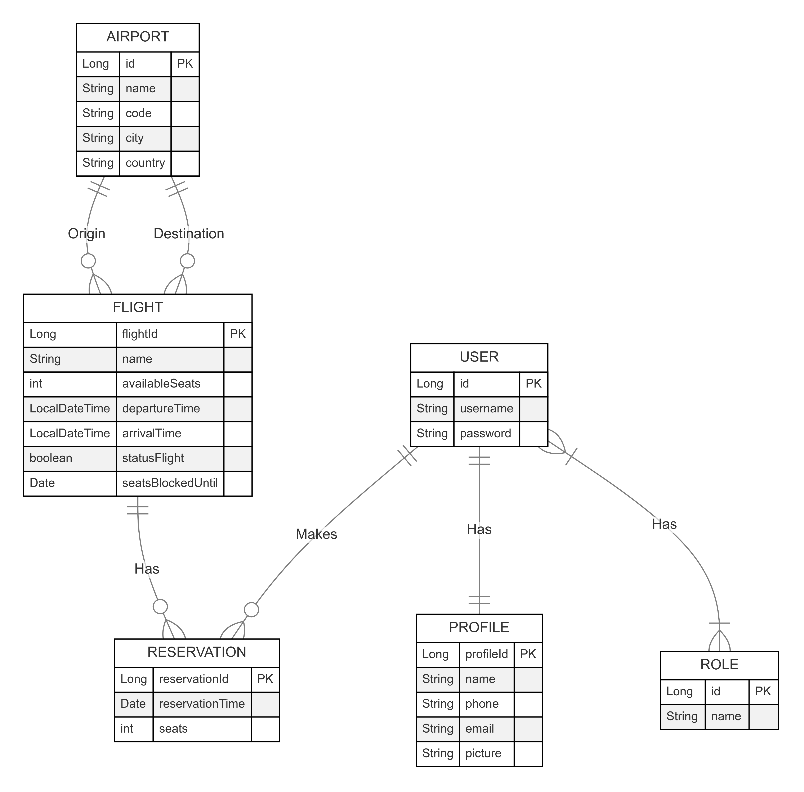
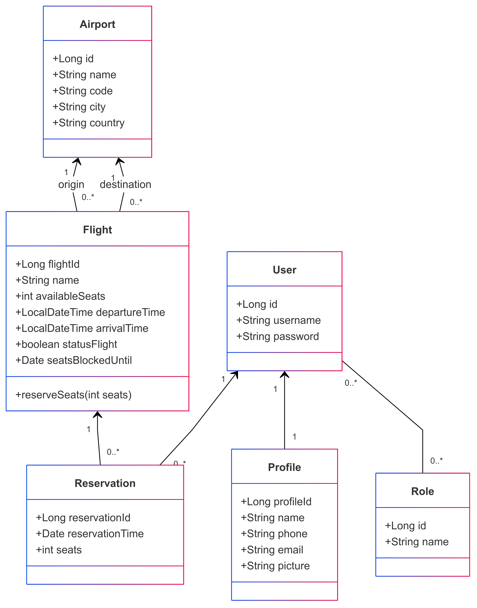

# Airline
## Project Description
The project aims to develop a management system for an airline using Spring with Spring Boot and
Spring Security. This system will allow comprehensive management of users, flights, reservations and
destinations, with advanced functionalities such as secure authentication using Basic Auth or JWT.
The system cannot allow the selection of flights without available seats or that have exceeded the deadline.
The project will be implemented using Java 21, Maven and MySQL or PostgreSQL.

## 🎯 Project objectives:

* Reinforce API creation concepts.
* Apply DB relationships.
* Establish login knowledge with Spring Security and Basic Auth or JWT.

⚙️ Project functional requirements:

1. Customer Management.
2. Registration, authentication and role management (ROLE_ADMIN and ROLE_USER).
3. Generation and validation of JWT tokens or session COOKIES if using Basic Auth for secure sessions.

⚙️ Flight management:

1. Flights should be automatically generated in the database at compile time (via .sql file).
2. Change the status of an available flight to “false” when the flight becomes unavailable or expires.

⚙️ Search engine:

1. Both the departure and destination airport must be indicated. The date and the number of seats to be booked. It is not necessary to indicate the type of seats.

⚙️ Reservation Management:

1. Allow flight reservations only if the selected route exists and if there is seat availability.
2. Check availability before confirming a reservation.
3. Once the flight reservation management has been started, the system must block the seats for a period of 15 minutes to guarantee seat availability.

⚙️ Authorized operations for the ADMIN user (ROLE_ADMIN):

1. CRUD of airports
2. CRUD of flight paths.
3. Summary list of reservations made by customers.
4. We must be able to obtain the list of reservation history for each user (ROLE_USER).

⚙️ Authorized operations for the CLIENT user (ROLE_USER):

1. Must be able to register
2. You must be able to upload your profile image and in case you do not have it configured then a default one will be shown.
3. You must be able to login
4. Customers must be able to obtain the list of their reservations with flight information.
5. Customers will not be able to make a reservation without prior login.

⚙️ Exception Management:

1. To be able to handle exceptions in a customized way.

⚙️ Non-functional Requirements

1. Security: Use of Spring Security and a choice between Basic Auth or JWT to protect the API.
2. Performance: Optimizations such as automatic flight status change and booking validation to maintain system efficiency.
3. Availability: Test implementation to ensure system stability in production.

## 🎯 EndPoints Overview:
    ⚙️ Airports

    1.POST /api/airports: Add a new airport.
    2. GET /api/airports: Get all airports.
    3. GET /api/airports/{id}: Get airport details by ID.
    4. GET /api/airports/{name}: Get airport details by NAME.
    5. PUT /api/airports/{id}: Update airport information.
    6. DELETE /api/airports/{id}: Delete an airport.

    ⚙️ Flights

    1. POST /api/flights: Create a new flight.
    2. GET /api/flights: Get all available flights.
    3. GET /api/flights/{id}: Get flight details by ID.
    4. PUT /api/flights/{id}: Update flight information.
    5. DELETE /api/flights/{id}: Delete a flight.

    ⚙️ Reservations

    1. POST /api/reservations: Create a new reservation.
    2. GET /api/reservations: Get all reservations.
    3. GET /api/reservations/{id}: Get reservation details by ID.
    4. PUT /api/reservations/{id}: Update a reservation.
    5. DELETE /api/reservations/{id}: Delete a reservation.

    ⚙️ Registers

    POST /api/v1/register: Create a new register.

    ⚙️ Users

    POST /api/v1/users: Create a new user.
    GET /api/v1/users/: Get all user details.
    GET /api/v1/users/{id}: Get user details by ID.
    PUT /api/v1/users/{id}: Update user details.
    DELETE /api/v1/users/{id}: Delete a user.

    ⚙️ Profiles

    GET /api/v1/profiles: Get all profile details.
    GET /api/v1/profiles/{id}: Get profile details by ID.
    GET /api/v1/profiles/{email}: Get profile details by email.
    PUT /api/v1/profiles/{id}: Update profile details.

## Diagrams

## Project Structure

.
├── estructura_proyecto.txt
├── HELP.md
├── mvnw
├── mvnw.cmd
├── pom.xml
├── README.md
├── src
│   ├── main
│   │   ├── java
│   │   │   └── com
│   │   │       └── reyestech24
│   │   │           └── Airline
│   │   │               ├── AirlineApplication.java
│   │   │               ├── Airport
│   │   │               │   ├── AirportController.java
│   │   │               │   ├── Airport.java
│   │   │               │   ├── AirportMapper.java
│   │   │               │   ├── AirportRepository.java
│   │   │               │   ├── AirportRequest.java
│   │   │               │   ├── AirportResponse.java
│   │   │               │   ├── AirportService.java
│   │   │               │   └── AirportValidationException.java
│   │   │               ├── Auth
│   │   │               │   └── AuthController.java
│   │   │               ├── Config
│   │   │               │   ├── BeansConfiguration.java
│   │   │               │   └── SecurityConfiguration.java
│   │   │               ├── exceptions
│   │   │               │   ├── AirlineAlreadyExistsException.java
│   │   │               │   ├── AirlineNotFoundException.java
│   │   │               │   ├── BadRequestException.java
│   │   │               │   ├── GlobalExceptionHandler.java
│   │   │               │   ├── ResourceNotFoundExceptions.java
│   │   │               │   └── UnauthorizedException.java
│   │   │               ├── facade
│   │   │               │   └── encryptions
│   │   │               │       ├── Base64System.java
│   │   │               │       ├── BcryptSystem.java
│   │   │               │       ├── EncryptionFacade.java
│   │   │               │       ├── IEncoder.java
│   │   │               │       └── IEncryptFacade.java
│   │   │               ├── Flight
│   │   │               │   ├── FlightController.java
│   │   │               │   ├── Flight.java
│   │   │               │   ├── FlightMapper.java
│   │   │               │   ├── FlightRepository.java
│   │   │               │   ├── FlightRequest.java
│   │   │               │   ├── FlightResponse.java
│   │   │               │   ├── FlightService.java
│   │   │               │   └── FlightValidationException.java
│   │   │               ├── home
│   │   │               │   └── HomeController.java
│   │   │               ├── profiles
│   │   │               │   ├── ProfileController.java
│   │   │               │   ├── Profile.java
│   │   │               │   ├── ProfileMapper.java
│   │   │               │   ├── ProfileRepository.java
│   │   │               │   ├── ProfileRequest.java
│   │   │               │   ├── ProfileResponse.java
│   │   │               │   ├── ProfileService.java
│   │   │               │   └── ProfileValidationExcepcion.java
│   │   │               ├── Register
│   │   │               │   ├── RegisterController.java
│   │   │               │   └── RegisterService.java
│   │   │               ├── Reservation
│   │   │               │   ├── ReservationController.java
│   │   │               │   ├── Reservation.java
│   │   │               │   ├── ReservationMapper.java
│   │   │               │   ├── ReservationRepository.java
│   │   │               │   ├── ReservationRequest.java
│   │   │               │   ├── ReservationResponse.java
│   │   │               │   ├── ReservationService.java
│   │   │               │   └── ReservationValidationException.java
│   │   │               ├── roles
│   │   │               │   ├── exceptions
│   │   │               │   │   ├── RoleException.java
│   │   │               │   │   └── RoleNotFoundException.java
│   │   │               │   ├── Role.java
│   │   │               │   ├── RoleRepository.java
│   │   │               │   └── RoleService.java
│   │   │               ├── security
│   │   │               │   ├── JpaUserDetailsService.java
│   │   │               │   └── SecurityUser.java
│   │   │               └── User
│   │   │                   ├── UserController.java
│   │   │                   ├── User.java
│   │   │                   ├── UserMapper.java
│   │   │                   ├── UserRepository.java
│   │   │                   ├── UserRequest.java
│   │   │                   ├── UserResponse.java
│   │   │                   └── UserService.java
│   │   └── resources
│   │       ├── application-h2.properties
│   │       ├── application-mysql.properties
│   │       ├── application-postgres.properties
│   │       ├── application.properties
│   │       ├── data.sql
│   │       ├── META-INF
│   │       │   └── additional-spring-configuration-metadata.json
│   │       ├── static
│   │       └── templates
│   └── test
│       └── java
│           └── com
│               └── reyestech24
│                   └── Airline
│                       ├── AirlineApplicationTests.java
│                       └── Airport
└── utils
├── ApiRest
│   └── Airline.postman_collection.json
├── erDiagram.mmd
├── erDiagram.png
├── UMLdiagram.mmd
├── UMLdiagram.png
└── user.png

## 💻 Technology Stack:

1. **Java**
2. **Spring Boot**
3. **Spring Security**
4. **IntelliJ**
5. **Maven**
6. **Postman**
7. **Docker**

## Author

|                                                                                  **Miguel Reyes**                                                                                    |
  | ----------------------------------------------------------------------------------------------------------------------------------------------------------------------------------- |
|              |
|  |